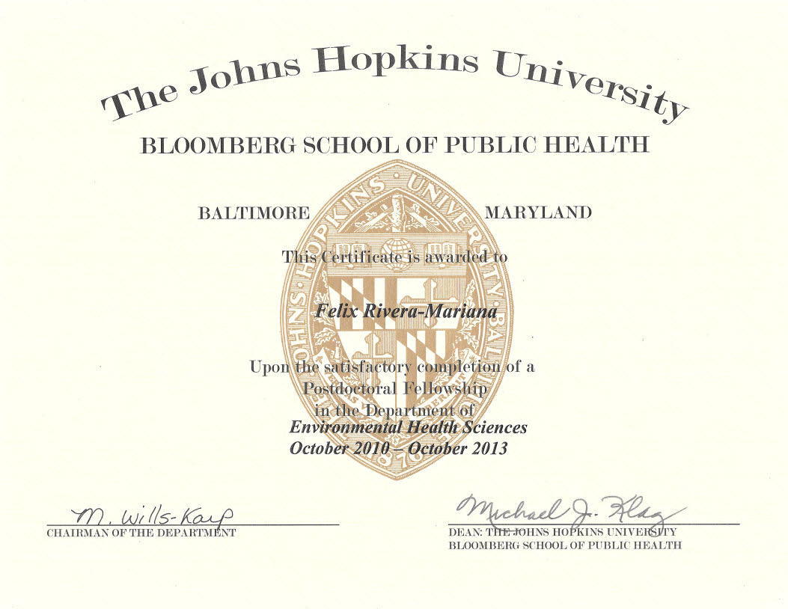
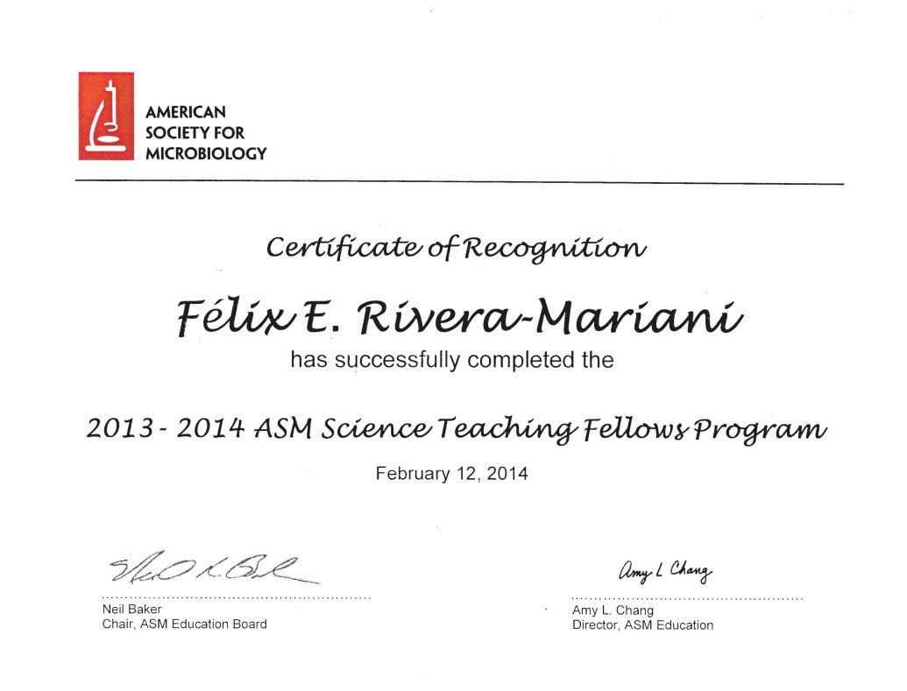

[**Home Page**](http://www.friveram.com/) | [**Publications**](http://www.friveram.com/publications) | [**Projects**](http://www.friveram.com/projects) | [**Computational**](http://www.friveram.com/compbio) | [**Teaching**](http://www.friveram.com/teaching) 

## CV, Fellowships, and Specializations

- [Updated CV](https://github.com/friveramariani/friveramariani.github.io/blob/master/CV/CV_FE_RiveraMariani.pdf)

- **Postdoctoral Fellowships at the Bloomberg School of Public Health of the Johns Hopkins University**

---

- **Science Teaching Fellowship at the American Society for Microbiology**

---

***Find below links to certificates of completed Specializations Statistics and Data Science***

#### Public Health-Related Statistical Training
+ [Statistical Reasoning for Public Health 1:  Estimation, Inference, & Interpretation](https://felix-riveramariani-ms9j.squarespace.com/s/2016-03-30_14-19-41.jpg) (Johns Hopkins University on www.coursera.org)
+ [Statistical Reasoning for Public Health II](https://www.coursera.org/account/accomplishments/certificate/ULDLF8DNRNBK): Regression Methods (Johns Hopkins University on www.coursera.org)
+ [Epidemiology: The Basic Science of Public Health](https://felix-riveramariani-ms9j.squarespace.com/s/2016-03-30_14-15-15.jpg) (University of North Carolina on www.coursera. org)

#### Data Science Specialization 
(Johns Hopkins University on www.coursera.org)

+ [Data Scientist's Toolbox](https://www.coursera.org/account/accomplishments/certificate/ADFK8XS4KQ)
+ [R Programming](https://www.coursera.org/account/accomplishments/certificate/FVYPGYJHLX)
+ [Getting and Cleaning Data](https://www.coursera.org/account/accomplishments/certificate/MYKBSXF2UZ)
+ [Exploratory Data Analysis](https://www.coursera.org/account/accomplishments/certificate/RTW25NHTER)
+ [Reproducible Research](https://www.coursera.org/account/accomplishments/certificate/PJFCMDGCEHW8)
+ [Statistical Inference](https://www.coursera.org/account/accomplishments/certificate/YLY4VNYEKYYN)
+ [Regression Analysis](https://www.coursera.org/account/accomplishments/certificate/7HT5S527A54Y)
+ [Practical Machine Learning](https://www.coursera.org/account/accomplishments/certificate/D4D9R9257JR4)
+ [Developing Data Products](https://www.coursera.org/account/accomplishments/certificate/VZY7NCY78272)
+ [Data Science Capstone](https://www.coursera.org/account/accomplishments/certificate/YQN7QSGWBQYV)

#### Executive Data Science Specialization 
(Johns Hopkins University on www.coursera.org)

+ [A Crash Course in Data Science](https://www.coursera.org/account/accomplishments/certificate/QEX5GHLLGGAP)
+ [Building a Data Science Team](https://www.coursera.org/account/accomplishments/certificate/DHZZQSCGA8H3)
+ [Managing Data Analysis](https://www.coursera.org/account/accomplishments/certificate/LAJ9YAFKSV8P)
+ [Data Science in Real Life](https://www.coursera.org/account/accomplishments/certificate/4C939ZY6WD29)
+ [Executive Data Science Capstone](https://www.coursera.org/account/accomplishments/certificate/42V4U2XH77PS)

### Mastering Software Development in R 
(Johns Hopkins University on www.coursera.org)

+ [R Programming Environment](https://www.coursera.org/account/accomplishments/certificate/JP664YGV9Y9J)
+ [Advanced R Programming](https://www.coursera.org/account/accomplishments/certificate/RJDCVEMTBE5Y)
+ [Building R Packages](https://www.coursera.org/account/accomplishments/certificate/N2CH7ZTQ4CFK)
+ Building Data Visualization Tools
+ R Programming Capstone

---

***Find below links to certificates of completed Genomic Data Science, System Biology, and Bioinformatics***

#### Genomic Data Science Specialization
(Johns Hopkins University on www.coursera.org)

+ [Introduction to Genomic Technologies](https://www.coursera.org/account/accomplishments/certificate/87PMNJZ8K4WM)
+ [Genomic Data Science with Galaxy](https://www.coursera.org/account/accomplishments/certificate/99PR74FA3AJ5)
+ [Python for Genomic Data Science](https://www.coursera.org/account/accomplishments/certificate/85A9MYCREQP4)
+ [Algorithms for DNA Sequencing](https://www.coursera.org/account/accomplishments/certificate/V6BACJBPHK56)
+ [Bioconductor for Genomic Data Science](https://www.coursera.org/account/accomplishments/certificate/HZS2UBV5EPUB)
+ [Statistics for Genomic Data Science](https://www.coursera.org/account/accomplishments/certificate/LLDYTFCEC98P)
+ [Command Line Tools for Genomic Data ](https://www.coursera.org/account/accomplishments/certificate/768YVZ2MP88A)
+ [Genomic Data Science Capstone](https://www.coursera.org/account/accomplishments/specialization/certificate/A2GJ4APKZB2E)

#### Systems Biology and Biotechnology Specialization 
(Icahn School of Medicine at Mount Sinai on www.coursera.org)

+ [Introduction to Systems Biology](https://www.coursera.org/account/accomplishments/certificate/XJA38ZQCN2DD)
+ [Experimental Methods in Systems Biology](https://www.coursera.org/account/accomplishments/certificate/2EK6888BHMEU)
+ [Network Analysis in Systems Biology](https://www.coursera.org/account/accomplishments/certificate/Y9TWGCY6G8Q5)
+ [Dynamical Modeling Methods for Systems Biology ](https://www.coursera.org/account/accomplishments/certificate/FJGE3VC5LSL6)
+ [Integrated Analysis in Systems Biology](https://www.coursera.org/account/accomplishments/records/PYB756UTBP8R)
+ [Systems Biology and Biotechnology Capstone ](https://www.coursera.org/account/accomplishments/specialization/certificate/PAK4FP7LG5GE)

#### Bioinformatics Specialization 
(University of California at San Diego, on www.coursera.org)

+ [Bioinformatics I (Finding Hidden Messages in DNA)](https://www.coursera.org/account/accomplishments/certificate/5CYJQQZ76Z39)
+ [Bioinformatics II (Genome Sequencing)](https://www.coursera.org/account/accomplishments/certificate/PSSVRW3JZYJC)
+ [Bioinformatics III (Comparing Genes, Proteins, and Genomes)](https://www.coursera.org/account/accomplishments/certificate/NMVPF7ZT29YL)
+ [Bioinformatics IV (Molecular Evolution)](https://www.coursera.org/account/accomplishments/certificate/VGB9A2SQKKUL)
+ [Bioinformatics V (Genomic Data Science and Clustering)](https://felix-riveramariani-ms9j.squarespace.com/s/Pages-from-ApplicationPackageBarryBiomed_RiveraMariani.pdf)
+ [Bioinformatics VI (Finding Mutations in DNA and Proteins)](https://www.coursera.org/account/accomplishments/certificate/39X9PLSJGS2B)
+ Bioinformatics Capstone (Big Data in Biology)

[**Click here to return to the Home Page**](https://www.friveram.com/)

&#169; Felix E. Rivera-Mariani, PhD 2017 <i>The contents of this website reflect the views of the author and does not represent the views of my institution.</i>.